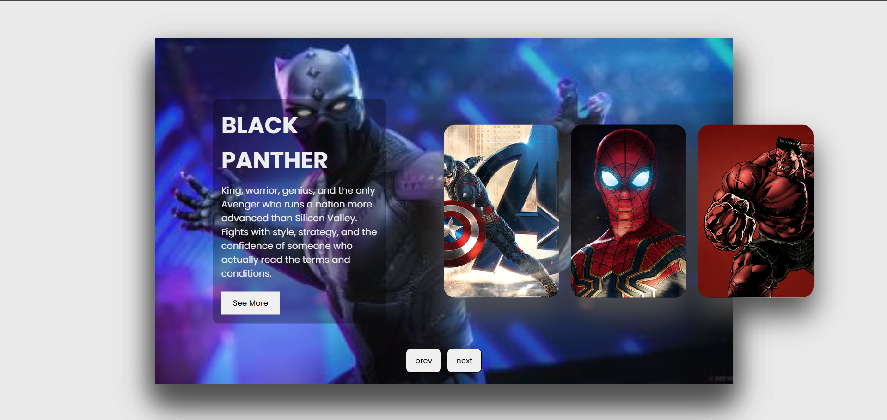

# 🦸 Avengers Slider (JavaScript)

A visually engaging **Avengers Slider** built using **HTML, CSS, and JavaScript** that allows users to navigate between different Marvel characters using smooth sliding transitions.

This project helps beginners understand **DOM manipulation, event handling, CSS positioning, and dynamic UI behavior**.

## 👋 Introduction

This beginner-friendly project focuses on building an interactive UI component using pure JavaScript.

It helps you understand:

- How JavaScript manipulates the **DOM structure dynamically**
- How to create a **carousel/slider effect without libraries**
- How CSS positioning and transitions work together
- How to handle **user interaction with buttons**

## 🖼️ Project Preview



*A smooth sliding carousel displaying Avengers characters with animated content.*

## 🎯 What Does This Project Do?

- Displays multiple Avengers characters in a slider layout  
- Allows navigation using **Next** and **Previous** buttons  
- Dynamically rearranges DOM elements for sliding effect  
- Uses CSS animations for smooth content transitions  
- Highlights the active character with detailed information  

This project demonstrates concepts used in:

- Portfolio sliders  
- Product showcases  
- Image carousels  
- Landing page hero sections  
- Interactive UI components  

## 🧠 JavaScript Concepts Used

- DOM selection (`querySelector`, `querySelectorAll`)  
- Event listeners (`addEventListener`)  
- Arrow functions  
- DOM manipulation (`appendChild`, `prepend`)  
- Node list handling  
- Dynamic UI updates  

## 🎨 CSS Concepts Used

- Absolute positioning  
- Transform & translate  
- CSS transitions  
- Box shadow effects  
- Keyframe animations  
- nth-child selectors  
- Responsive layout styling 

## 📁 Project Structure

```text
AvengersSlider/
├── index.html
├── style.css
├── script.js
├── images/
│   ├── spiderman.jpg
│   ├── hulk.jpg
│   ├── thor.jpg
│   ├── ironman.png
│   ├── black panther.jpg
│   └── captain.jpg
└── README.md
```

## ⚙️ How It Works

- All Avengers cards are placed inside a `.slide` container.
- Only the first two items take full width using CSS `nth-child` selectors.
- When the **Next** button is clicked:
  - The first `.item` is moved to the end using `appendChild()`.
- When the **Previous** button is clicked:
  - The last `.item` is moved to the beginning using `prepend()`.
- CSS automatically repositions elements based on their new order.
- The second element displays character content with animation.

## 🔍 Important Logic

```javascript
next.addEventListener("click", () => {
    let items = document.querySelectorAll(".item");
    document.querySelector(".slide").appendChild(items[0]);
});
```

This moves the first item to the end, creating a sliding illusion.

```javascript
prev.addEventListener("click", () => {
    let items = document.querySelectorAll(".item");
    document.querySelector(".slide").prepend(items[items.length - 1]);
});
```

This moves the last item to the front, enabling backward navigation.

## ✨ Features

- Smooth sliding transition  
- Animated text content  
- Clean and modern UI  
- Fully built using **Vanilla JavaScript**  
- No external libraries used  
- Interactive navigation buttons  

## 🧪 Practice Improvements

Once comfortable, try adding:

- Auto-slide functionality with `setInterval`
- Swipe gesture support (for mobile)
- Indicators (dots navigation)
- Autoplay with pause on hover
- Responsive design for smaller screens
- Add modal popup for character details

## 📚 Learning Outcomes

After completing this project, you will be able to:

- Build a functional slider from scratch
- Understand how DOM rearrangement creates animation effects
- Combine CSS transitions with JavaScript logic
- Create interactive UI components without frameworks
- Strengthen your frontend fundamentals

## 🚀 Next Steps

- Add autoplay feature
- Make it fully responsive
- Convert it into a reusable component
- Rebuild it using React
- Combine with API to dynamically load characters

## 💡 Final Note

- Focus on understanding how DOM rearrangement creates the sliding illusion.
- Mastering small UI projects like this builds strong frontend foundations.
- Avoid relying on libraries before understanding core logic.

Happy Coding 🦸✨