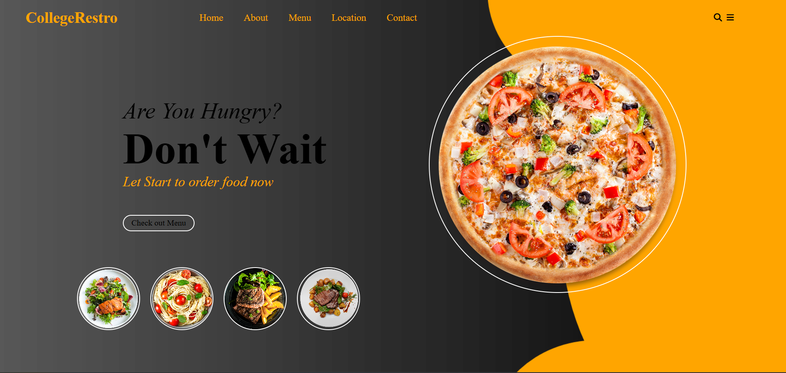

# 🍽️ CollegeRestro (Interactive Food Landing Page)

A modern and visually appealing **College Restaurant Landing Page** built using **HTML, CSS, and JavaScript**.

This project demonstrates how to create an interactive food preview system where users can click on food items to dynamically change the main display image.

It is ideal for beginners learning **DOM manipulation, event handling, layout design, and UI structuring**.

## 👋 Introduction

This beginner-friendly project focuses on building a clean restaurant-style landing page with interactive elements.

It helps you understand:

- How to design structured layouts using **Flexbox**
- How to dynamically update UI using **JavaScript**
- How to work with background images
- How to build visually appealing landing pages

## 🖼️ Project Preview



*A college restaurant-themed landing page with clickable food previews.*

## 🎯 What Does This Project Do?

- Displays a restaurant-themed homepage
- Shows a hero section with promotional text
- Displays a large circular food preview
- Allows users to click smaller food items to change the main display image
- Uses clean layout and modern UI styling

This project demonstrates concepts used in:

- Restaurant websites
- Product preview sections
- Food delivery landing pages
- Portfolio UI designs
- Interactive hero sections

## 🧠 JavaScript Concepts Used

- DOM selection (`getElementById`)
- Event handling (`addEventListener`)
- Arrow functions
- Dynamic style manipulation
- Background image updates
- User interaction handling

## 🎨 CSS Concepts Used

- Flexbox layout
- Background images
- Border radius (circular UI)
- Spacing and alignment
- Typography styling
- Hover and UI structuring
- Responsive layout foundation

## 📁 Project Structure

```text
CollegeRestro/
├── index.html
├── style.css
├── images/
│   ├── Background2.png
│   ├── food.png
│   ├── food1.png
│   ├── food2.png
│   ├── food3.png
│   └── food4.png
└── README.md
```

## ⚙️ How It Works

- The main food image is displayed inside a circular container.
- Four smaller food thumbnails are shown below.
- Each thumbnail has a click event listener.
- When clicked, JavaScript changes the `backgroundImage` of the main food container.
- The UI updates instantly without page reload.

## 🔍 Important Logic

```javascript
food1.addEventListener("click", () =>{
    food.style.backgroundImage = "url('/images/food1.png')";
});
```

This updates the main food preview dynamically when a thumbnail is clicked.

The same logic is repeated for other food items to create interactive switching.

## ✨ Features

- Clean and modern UI
- Interactive food preview
- Circular food display design
- Minimal and structured layout
- Fully built using Vanilla JavaScript
- Beginner-friendly implementation

## 🧪 Practice Improvements

Once comfortable, try adding:

- Smooth fade animation while switching images
- Mobile responsiveness
- Menu section with pricing
- Order Now button functionality
- Toggle navigation menu for small screens
- Add transition effects to thumbnails

## 📚 Learning Outcomes

After completing this project, you will be able to:

- Manipulate DOM elements dynamically
- Update CSS styles using JavaScript
- Design clean landing page layouts
- Work with background images effectively
- Create interactive UI components

## 🚀 Next Steps

- Make it fully responsive
- Add real menu items with prices
- Connect to backend for order handling
- Convert into a React component
- Build a full food delivery UI system

## 💡 Final Note

- Focus on understanding how DOM manipulation updates UI instantly.
- Mastering interactive UI projects like this strengthens frontend fundamentals.
- Small projects like this build strong confidence in JavaScript.

Happy Coding 🍔✨