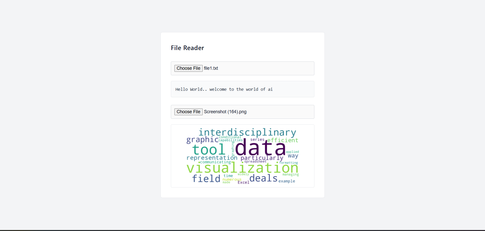

# 📂 File Reader API (JavaScript)

A clean and minimal **File Reader Application** built using **HTML, CSS, and JavaScript** that allows users to read and preview both text files and image files directly in the browser.

This project demonstrates how to use the **JavaScript FileReader API** to handle local file input without uploading data to a server.

## 👋 Introduction

This beginner-friendly project focuses on understanding how browsers handle local files securely using JavaScript.

It helps you understand:

- How to work with the **FileReader API**
- How to read text files dynamically
- How to preview images before upload
- How to update the UI instantly using JavaScript

## 🖼️ Project Preview



*A simple interface where users can upload a text file or image and preview its content instantly.*

## 🎯 What Does This Project Do?

- Allows users to upload a **text file**
- Displays the file content inside a `<pre>` element
- Allows users to upload an **image file**
- Previews the selected image instantly
- Uses a clean, minimal UI design

This project demonstrates concepts used in:

- Resume preview systems  
- Document viewers  
- Image preview before upload  
- Admin dashboards  
- File validation systems  

## 🧠 JavaScript Concepts Used

- DOM selection (`querySelector`)
- Event handling (`addEventListener`)
- FileReader API
- `readAsText()` method
- `readAsDataURL()` method
- Handling file input (`files[0]`)
- Updating DOM dynamically

## 🎨 CSS Concepts Used

- Flexbox centering
- Clean minimal UI design
- Box model styling
- Borders and spacing
- Scrollable containers
- Object-fit for images
- Responsive container design

## 📁 Project Structure

```text
FileReaderAPI/
├── index.html
├── style.css
└── README.md
```

## ⚙️ How It Works

### 📄 Text File Handling

- User selects a text file.
- JavaScript captures the file using `files[0]`.
- `FileReader.readAsText()` reads the file content.
- The result is displayed inside a `<pre>` element.
- Content updates instantly without page reload.

### 🖼️ Image File Handling

- User selects an image file.
- `FileReader.readAsDataURL()` converts the file into a Base64 URL.
- The image `src` attribute is updated dynamically.
- The image preview appears instantly.

## 🔍 Important Logic

### Reading Text File

```javascript
txtInput.addEventListener('change', () => {
    let file = txtInput.files[0];
    let fr = new FileReader();
    fr.readAsText(file);
    fr.onload = () => {
        outputEle1.textContent = fr.result;
    };
});
```

### Reading Image File

```javascript
imgInput.addEventListener('change', () =>{
    let file = imgInput.files[0];
    let fr = new FileReader();
    fr.readAsDataURL(file);
    fr.onload = () =>{
        outputEle2.src = fr.result;
    };
});
```

## ✨ Features

- Text file preview
- Image file preview
- Clean and minimal UI
- No backend required
- Fully built using Vanilla JavaScript
- Instant content rendering
- Beginner-friendly implementation


## 🧪 Practice Improvements

Once comfortable, try adding:

- File size validation
- File type validation
- Drag and drop support
- Multiple image preview
- Display file name and size
- Error handling for unsupported files
- Dark mode toggle

## 📚 Learning Outcomes

After completing this project, you will be able to:

- Use the JavaScript FileReader API
- Handle local file input securely
- Read and preview different file types
- Update UI dynamically without reload
- Build real-world frontend features

## 🚀 Next Steps

- Add file upload progress indicator
- Convert it into a reusable component
- Add PDF preview support
- Connect to backend for file storage
- Integrate with cloud storage systems

## 💡 Final Note

- Understanding the FileReader API is essential for building modern web applications.
- Many real-world applications use similar logic for previewing files before upload.
- Mastering file handling improves your frontend development skills significantly.

Happy Coding 📂✨